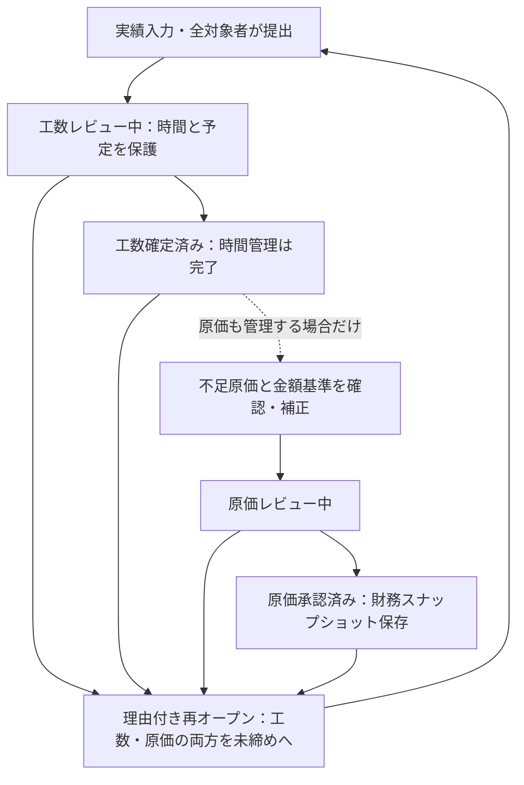

# kosu 業務フロー

画面操作は [user-guide.md](./user-guide.md) を参照してください。中心は「仕事の配分・実績・工数確定」です。簡易原価は必要なチームだけ使います。

## 1. 仕事の配分から振り返りまで

1. 管理者がメンバー・案件・アサインを登録します。社内作業も一つの案件です。単価や金額は任意です。
2. 月前に `/monthly-plans/admin` で担当者・案件ごとの予定時間を登録します。稼働可能時間を入れると月単位の余力・超過を確認できます。
3. 担当者ごとの予定を確認します。未確認の残りは仮の値、確認済みの残りは予定上の余力です。週内の空きやスキル適合は保証しません。
4. メンバーが日次・週次画面で総稼働時間と案件別実績を入力します。日次予定は任意の補助です。月別総稼働時間は実績であり、予定の稼働可能時間とは別です。
5. 月末に `/work-logs/month` で配賦の差分を直して提出します。対象者は0時間でも明示提出します。管理者は代理提出できます。
6. 管理者が `/period-locks` で工数レビュー・確定を行います。時間だけの管理はここで完了です。
7. 必要なら任意の原価領域で不足を補い、原価レビュー・承認を行います。
8. `/reports/planned-vs-actual` の同じ月の予実比較を翌月の配分に活かします。

予定・稼働可能時間を変更すると、その担当者・月の予定確認は解除されます。実績・日次予定・欠損原価だけの変更では解除されません。予定確認は工数提出・確定の必須条件ではありません。

## 2. 月次締めの二つの状態

未作成月は工数未確定・原価未確認です。工数確定だけでは原価承認になりません。金額なしで「工数確定済み / 原価未確認」のまま運用できます。

## 3. 確認条件と編集保護

| 確認事項 | 工数レビュー・確定 | 原価レビュー・承認 |
| --- | --- | --- |
| 全対象者の提出 | 必須 | 必須 |
| 保存された勤務時間と配賦の一致 | 必須 | 必須 |
| 工数の確定 | レビュー後に確定 | 必須 |
| 当月予定・当月実績・過去実績の欠損単価 | 不要 | 解消が必要 |
| 活動中の請求対象案件の契約売上・人件費予算 | 不要 | 必須 |
| 予定・稼働可能時間・予定確認 | 任意 | 任意 |
| 日次予定と月次予定の差 | 確定を妨げない | 警告のみ |

確認は画面表示時だけでなく、状態を変える処理内でも再実行します。未提出は対象メンバー、不一致は対象日へのリンクから修正します。未入力日や活動0時間の案件を架空の実績で埋める必要はありません。

工数がレビュー中・確定済み、または原価がレビュー中・承認済みなら、管理者を含めて実績・配賦・予定・稼働可能時間・コピー・CSV・提出・予定確認を変更できません。

欠損原価の専用補正だけは、工数保護中でも選択月と元データの月の原価が両方未確認なら可能です。管理者が明示単価（0円も可）と理由を記録し、欠けた単価だけを補います。すでに設定済みの単価は上書きできません。元データが原価レビュー中・承認済みなら、その月も再オープンが必要です。

## 4. 原価と再オープンの注意点

- 時間だけを使う場合、単価・金額不足は工数確定を妨げません。原価も使う場合は過去の単価欠損が累計原価に影響するため補正します。現在のメンバー単価を変えても過去分は自動補完されません。
- 工数予算の超過や予定の不一致は入力を止めません。案件責任者が配分変更や追加予算を判断します。
- 再オープンには理由が必須で、工数・原価の旧状態と操作者・時刻を記録します。提出は実績変更まで維持します。実績変更後は該当メンバー・月だけ再提出します。
- 原価承認時だけ案件財務を保存します。その後の案件名・金額基準・単価・将来実績の変更では承認済みの表示は変わりません。再オープン直後は履歴と保存値を保持しますが、画面は未承認の現在値を表示します。再承認で保存し直します。
- 簡易原価は直接人件費だけです。外注費・経費・間接費・税・請求・入金・給与計算は含みません。

## 5. 移行と復旧

旧原価の未締め・レビュー中・承認済みは、工数の未確定・レビュー中・確定済みに移行します。利用可能な操作者・日時を引き継ぎ、移行履歴を追加します。原価状態・既存履歴・財務保存値・提出記録は保持します。旧レビュー中の月は工数を確定して原価承認を続けられます。

工数状態を追加した新しいデータベースに、旧アプリだけを戻してはいけません。旧アプリは工数のみの保護を認識しません。戻す場合はアプリを停止し、移行後の入力を別途保存したうえで、移行前バックアップと対応する旧アプリをセットで復元してください。復元によって戻るデータ期間を利用者に知らせてください。
