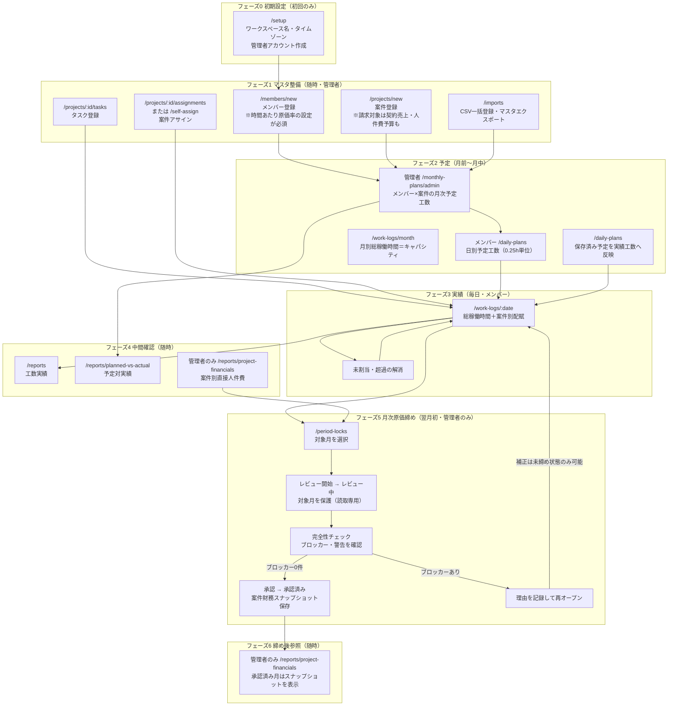
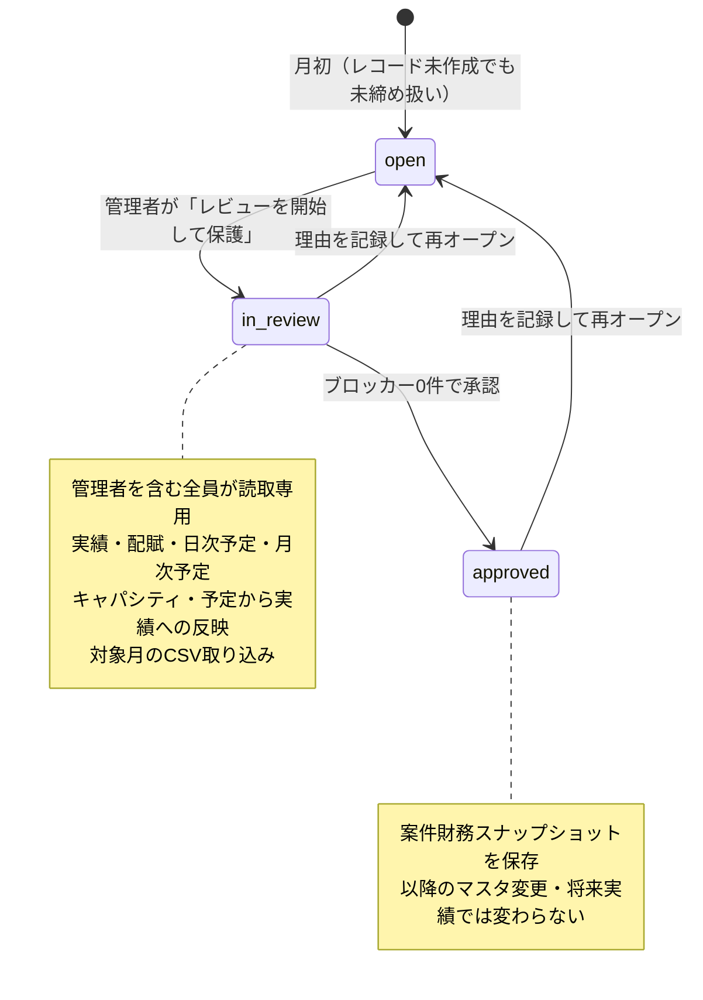

# kosu 業務フロー

画面ごとの操作手順は [user-guide.md](./user-guide.md) にあります。この文書は **誰が・いつ・どの順で何をするか** を一枚で俯瞰するためのものです。月次の一連の流れ、月次締めの状態遷移、締めを止める条件をまとめています。

## 1. 全体フロー（月次サイクル）

### フェーズ別の要点

| フェーズ       | 時期       | 主担当           | 画面                                                                    | 内容                                                       |
| -------------- | ---------- | ---------------- | ----------------------------------------------------------------------- | ---------------------------------------------------------- |
| 0 初期設定     | 初回のみ   | 管理者           | `/setup`                                                                | ワークスペース名、デフォルトタイムゾーン、管理者アカウント |
| 1 マスタ整備   | 随時       | 管理者           | `/members`, `/projects`, `/imports`                                     | メンバー・案件・タスク・アサイン、CSV一括登録              |
| 2 予定         | 月前〜月中 | 管理者＋メンバー | `/monthly-plans/admin`, `/daily-plans`, `/work-logs/month`              | 月次予定（管理者）、日別予定（メンバー）、キャパシティ     |
| 3 実績         | 毎日       | メンバー         | `/work-logs/:date`                                                      | 総稼働時間の入力と案件別配賦、未割当・超過の解消           |
| 4 中間確認     | 随時       | メンバー＋管理者 | `/reports`, `/reports/planned-vs-actual`, `/reports/project-financials` | 工数実績、予定対実績、案件別直接人件費                     |
| 5 月次原価締め | 翌月初     | 管理者のみ       | `/period-locks`                                                         | レビュー開始 → 完全性チェック → 承認                       |
| 6 締め後参照   | 随時       | 管理者           | `/reports/project-financials`                                           | 承認済み月は承認時点のスナップショットを表示               |

## 2. 月次締めの状態遷移

対象月は `未締め → レビュー中 → 承認済み` の3状態を持ちます。レコードが無い月は `未締め` として扱われます。

### 操作可能なタイミング

| 操作                                 | 未締め | レビュー中 | 承認済み |
| ------------------------------------ | :----: | :--------: | :------: |
| 実績・配賦・予定・キャパシティの編集 |   可   |    不可    |   不可   |
| 対象月のCSV取り込み                  |   可   |    不可    |   不可   |
| 原価スナップショットの補正           | **可** |    不可    |   不可   |
| レビュー開始                         |   可   |     -      |    -     |
| 承認                                 |   -    |     可     |    -     |
| 再オープン（理由必須）               |   -    |     可     |    可    |

保護された月に対する書き込みは `423 Locked` で拒否されます。**原価の補正は未締め状態でしかできない**ため、レビュー中にブロッカーが見つかった場合は「再オープン → 補正 → 再度レビュー開始」という往復が発生します。

## 3. 完全性チェック（承認の条件）

承認には **ブロッカー0件** が必要です。警告は承認を妨げません。活動が0時間の案件や未入力日は欠損として扱われません。

| コード                               | 種別       | 内容                                                 | 対処画面               |
| ------------------------------------ | ---------- | ---------------------------------------------------- | ---------------------- |
| `UNBALANCED_WORK_LOG`                | ブロッカー | 勤務時間と配賦時間が一致しない                       | `/work-logs/:date`     |
| `MISSING_MONTHLY_PLAN_COST`          | ブロッカー | 月次予定の原価スナップショットが未設定               | `/monthly-plans/admin` |
| `MISSING_MONTHLY_ALLOCATION_COST`    | ブロッカー | 当月実績の原価スナップショットが未設定               | `/work-logs/:date`     |
| `MISSING_HISTORICAL_ALLOCATION_COST` | ブロッカー | 累計実績（当月より前）の原価スナップショットが未設定 | `/work-logs/:date`     |
| `MISSING_BILLABLE_CONTRACT_REVENUE`  | ブロッカー | 活動中の請求対象案件に契約売上が未設定               | `/projects/:id`        |
| `MISSING_BILLABLE_LABOR_BUDGET`      | ブロッカー | 活動中の請求対象案件に人件費予算が未設定             | `/projects/:id`        |
| `DAILY_MONTHLY_PLAN_MISMATCH`        | 警告       | 日次予定と月次予定の合計が一致しない                 | `/daily-plans`         |

原価スナップショットは、月次予定・実績配賦の**保存時点**の `members.hourlyCostRate` から写されます。後からメンバーの原価率を変更しても過去分には反映されないため、補正は「明示単価＋補正理由」を記録して1件ずつ行います。

## 4. 運用上の注意点

フロー全体を見ないと気づきにくい箇所です。

- **原価率の未設定は後から効きます。** メンバーに原価率を設定しないまま運用すると、その期間の配賦が `MISSING_HISTORICAL_ALLOCATION_COST` として残り、**以降の毎月の締めがブロックされます**。補正は1件ずつで、対象月が未締めのときしか実行できません。運用開始前に全メンバーの原価率を設定してください。
- **予定は二重体系です。** 月次予定（管理者）と日別予定（メンバー）が別に存在し、不一致は警告止まりで蓄積します。どちらを正とするか運用ルールを決めてください。
- **レビュー中は補正できません。** ブロッカーを直すには再オープンが必要で、再オープンには理由の記録が必須です。月初の締め作業は「レビュー開始 → 再オープン → 補正 → 再レビュー」の往復を見込んでください。
- **承認は取り消せますが、スナップショットは作り直しになります。** 承認済み月を再オープンすると案件財務の保存値が更新対象に戻ります。
- **旧バージョンの月次ロックは「レビュー中」に移行します。** アップグレード後は改めて完全性確認と承認が必要です。
- **承認済み月の案件財務は遡って変わりません。** その後の案件名・基準額・原価率・アーカイブ状態・将来実績の変更では更新されません。
- **労務粗利は直接人件費のみです。** 仕入れ、外注費、経費、税金、請求・入金、給与計算は含まれません。会計・請求・給与の確定値として利用しないでください。
